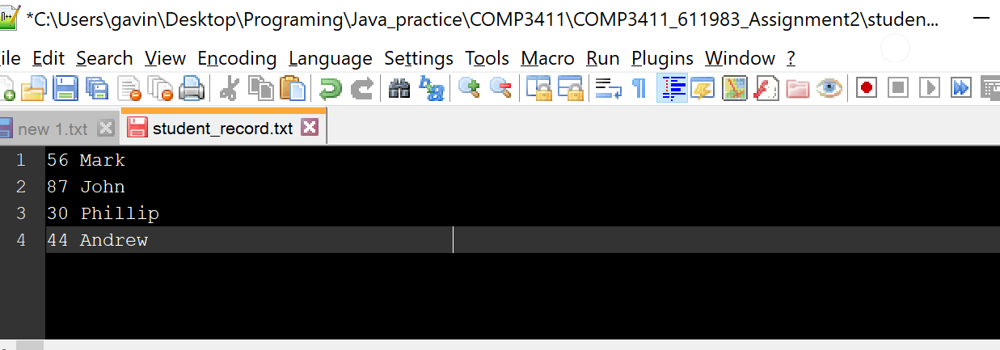
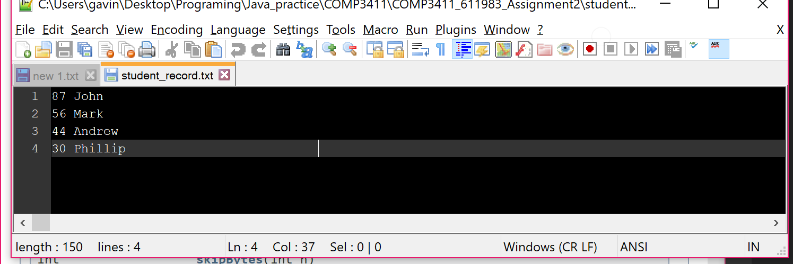
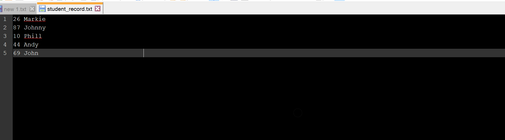
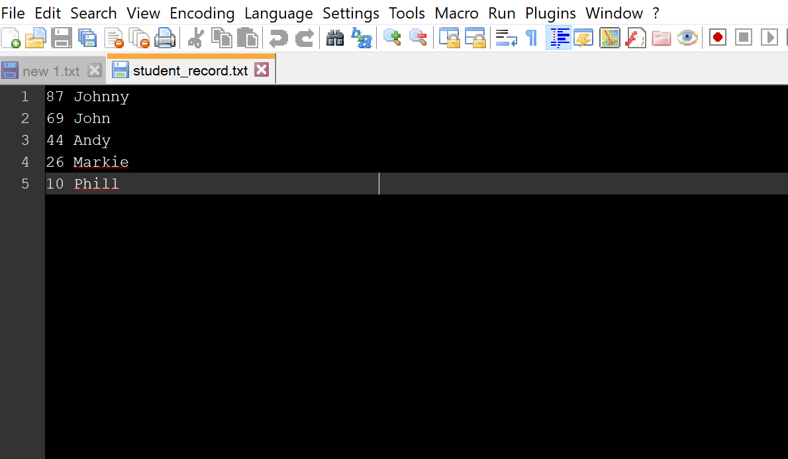

# FileOrganizer
FileOrganizer will organize a record file named "student_record.txt" the file contains an integer and student name where each record is 36bytes. The record is organized from descending order(the greater integer associated is moved up in the record list and the lesser is moved down) this is done in a bubble sorting method where each record is checked and compared to the next record. If these records are in the wrong order they will be rearranged. (this is repeated until no changes are made)                                  

# Testing

## Test 1
Bellow is a screen shot of the text inside of “student_record” before running the program 

  Bellow is a screenshot after running the program

## Test 2
  Text before running the program

  Finally this is the results of the program

